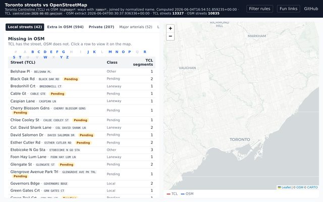
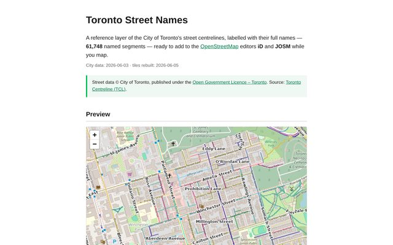
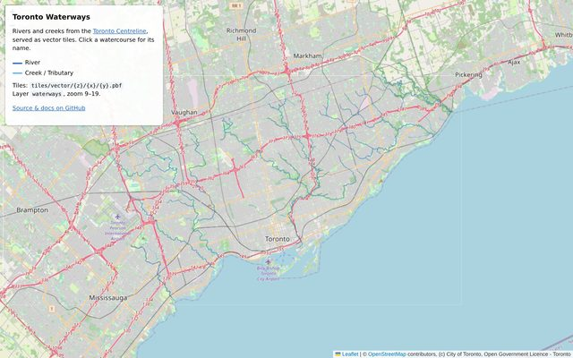
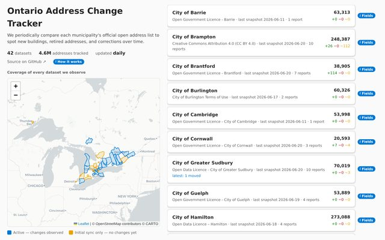
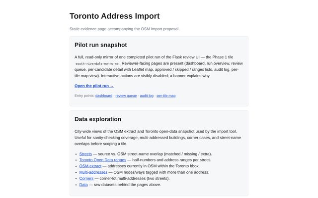
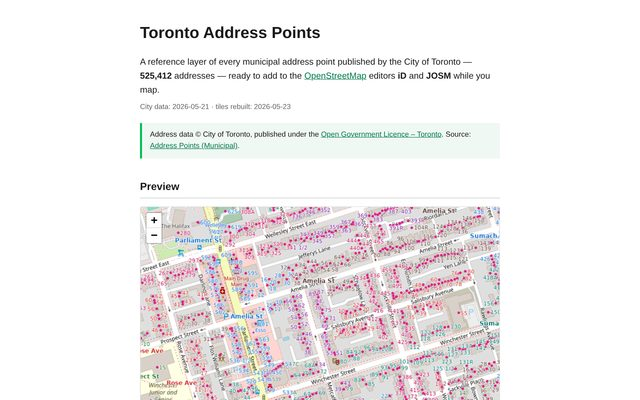
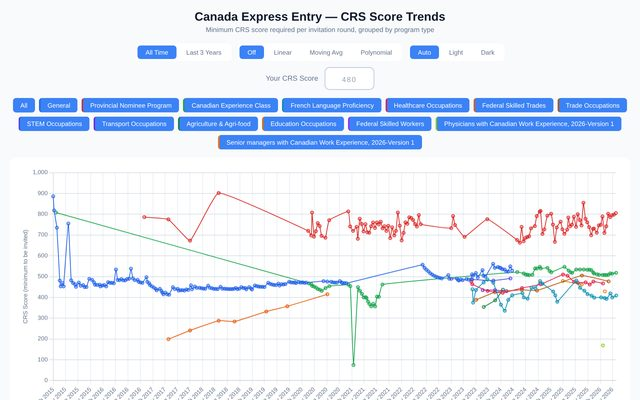
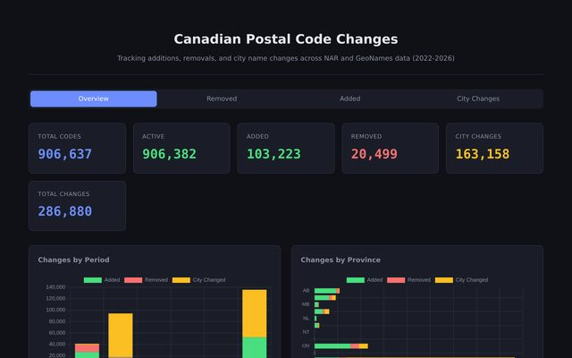

### skfd — working on

Toronto · OpenStreetMap & open-data tooling · [comentality](https://github.com/comentality)

Thumbnail & title → live site · <code>code</code> → source

|  |  |  |
|:--|:--|:--|
|  **[toronto-streets-osm](https://skfd.github.io/toronto-streets-osm/)** Centreline ↔ OSM road QA · [`code`](https://github.com/skfd/toronto-streets-osm) |  **[toronto-streets-layer](https://skfd.github.io/toronto-streets-layer/)** Street tiles for iD/JOSM · [`code`](https://github.com/skfd/toronto-streets-layer) |  **[toronto-waterways-layer](https://skfd.github.io/toronto-waterways-layer/)** Rivers + creeks tiles · [`code`](https://github.com/skfd/toronto-waterways-layer) |
|  **[ontario-address-changes](https://skfd.github.io/ontario-address-changes/)** Ontario civic-address change tracker · [`code`](https://github.com/skfd/ontario-address-changes) |  **[toronto-2-address-import](https://skfd.github.io/toronto-2-address-import/)** Address conflation + review UI · [`code`](https://github.com/skfd/toronto-2-address-import) |  **[toronto-addresses-layer](https://skfd.github.io/toronto-addresses-layer/)** Address tiles for iD/JOSM · [`code`](https://github.com/skfd/toronto-addresses-layer) |

### More projects

|  |  |  |
|:--|:--|:--|
|  **[express_entry_score_stats](https://skfd.github.io/express_entry_score_stats/)** Canada Express Entry CRS trends · [`code`](https://github.com/skfd/express_entry_score_stats) |  **[canada-postal-code-changes](https://skfd.github.io/canada-postal-code-changes/)** Postal code change tracker · [`code`](https://github.com/skfd/canada-postal-code-changes) |  **[holy-bip39le](https://skfd.github.io/holy-bip39le/)** BIP39 wallets hidden in literature · [`code`](https://github.com/skfd/holy-bip39le) |
|  **[chinamaxxing-checklist](https://skfd.github.io/chinamaxxing-checklist/)** Become-a-China-expert checklist · [`code`](https://github.com/skfd/chinamaxxing-checklist) |  |  |

**No live demo:** [bikeshare-toronto-maproulette](https://github.com/skfd/bikeshare-toronto-maproulette) · [token-budget](https://github.com/skfd/token-budget) · [FixMeAwesome](https://github.com/skfd/FixMeAwesome)

📫 kk@comentality.com

<!-- Repo must be named exactly "skfd" to render on your profile. Thumbnails live in assets/shot