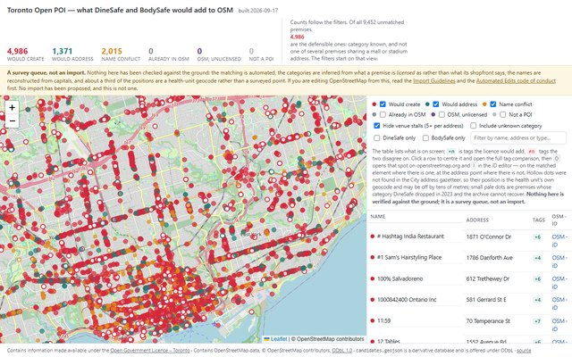
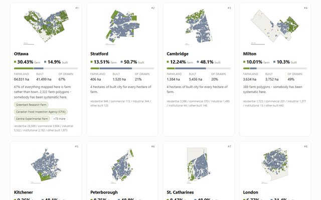

currently: watching what Ontario municipalities quietly change in their open address data — <a href="https://github.com/skfd/ontario-address-changes">ontario-address-changes</a>

<h3>Toronto · OpenStreetMap & open-data tooling</h3>

<table>
<tr>
<td valign="top" width="33%">
 
<b><a href="https://skfd.github.io/toronto-streets-osm/">toronto-streets-osm</a></b> 
Centreline ↔ OSM road QA · <a href="https://github.com/skfd/toronto-streets-osm"><code>code</code></a>
</td>
<td valign="top" width="33%">
 
<b><a href="https://skfd.github.io/toronto-streets-layer/">toronto-streets-layer</a></b> 
Street tiles for iD/JOSM · <a href="https://github.com/skfd/toronto-streets-layer"><code>code</code></a>
</td>
<td valign="top" width="33%">
 
<b><a href="https://skfd.github.io/ontario-address-changes/">ontario-address-changes</a></b> 
Ontario civic-address change tracker · <a href="https://github.com/skfd/ontario-address-changes"><code>code</code></a>
</td>
</tr>
<tr>
<td valign="top">
 
<b><a href="https://skfd.github.io/toronto-2-address-import/">toronto-2-address-import</a></b> 
Address conflation + review UI · <a href="https://github.com/skfd/toronto-2-address-import"><code>code</code></a>
</td>
<td valign="top">
 
<b><a href="https://skfd.github.io/toronto-addresses-layer/">toronto-addresses-layer</a></b> 
Address tiles for iD/JOSM · <a href="https://github.com/skfd/toronto-addresses-layer"><code>code</code></a>
</td>
<td valign="top">
 
<b><a href="https://skfd.github.io/oakville-address-layer/">oakville-address-layer</a></b> 
Oakville address tiles for iD/JOSM · <a href="https://github.com/skfd/oakville-address-layer"><code>code</code></a>
</td>
</tr>
<tr>
<td valign="top">
 
<b><a href="https://skfd.github.io/toronto-parks-layer/">toronto-parks-layer</a></b> 
Parks + green-space tiles · <a href="https://github.com/skfd/toronto-parks-layer"><code>code</code></a>
</td>
<td valign="top">
 
<b><a href="https://skfd.github.io/toronto-open-poi/">toronto-open-poi</a></b> 
What DineSafe &amp; BodySafe would add to OSM · <a href="https://github.com/skfd/toronto-open-poi"><code>code</code></a>
</td>
<td valign="top"></td>
</tr>
</table>

<h3>Data stories (data journalism)</h3>

<table>
<tr>
<td valign="top" width="33%">
 
<b><a href="https://skfd.github.io/express_entry_score_stats/">express_entry_score_stats</a></b> 
Canada Express Entry CRS trends · <a href="https://github.com/skfd/express_entry_score_stats"><code>code</code></a>
</td>
<td valign="top" width="33%">
 
<b><a href="https://skfd.github.io/canada-postal-code-changes/">canada-postal-code-changes</a></b> 
Postal code change tracker · <a href="https://github.com/skfd/canada-postal-code-changes"><code>code</code></a>
</td>
<td valign="top" width="33%">
 
<b><a href="https://skfd.github.io/ontario-farmland/">ontario-farmland</a></b> 
Farmland vs the built city, 48 municipalities · <a href="https://github.com/skfd/ontario-farmland"><code>code</code></a>
</td>
</tr>
</table>

<h3>Just for fun</h3>

<table>
<tr>
<td valign="top" width="33%">
 
<b><a href="https://skfd.github.io/holy-bip39le/">holy-bip39le</a></b> 
BIP39 wallets hidden in literature · <a href="https://github.com/skfd/holy-bip39le"><code>code</code></a>
</td>
<td valign="top" width="33%">
 
<b><a href="https://skfd.github.io/chinamaxxing-checklist/">chinamaxxing-checklist</a></b> 
Become-a-China-expert checklist · <a href="https://github.com/skfd/chinamaxxing-checklist"><code>code</code></a>
</td>
<td valign="top" width="33%">
 
<b><a href="https://skfd.github.io/iba-cocktails/">iba-cocktails</a></b> 
All 87 official IBA cocktails, tracked · <a href="https://github.com/skfd/iba-cocktails"><code>code</code></a>
</td>
</tr>
<tr>
<td valign="top">
 
<b><a href="https://skfd.github.io/beef-phrasebook/">beef-phrasebook</a></b> 
One cow, seven butchery traditions, in 3D · <a href="https://github.com/skfd/beef-phrasebook"><code>code</code></a>
</td>
<td valign="top">
 
<b><a href="https://skfd.github.io/bar-birthday/">bar-birthday</a></b> 
Ontario pubs: how old, and how long on the map · <a href="https://github.com/skfd/bar-birthday"><code>code</code></a>
</td>
<td valign="top"></td>
</tr>
</table>

<h3>Windows software</h3>

<table>
<tr>
<td valign="top" width="33%">
 
<b><a href="https://github.com/skfd/token-budget">token-budget</a></b> 
Windows 11 widget for LLM token quotas · desktop app
</td>
<td valign="top" width="33%">
 
<b><a href="https://github.com/skfd/mobile-internet-widget">mobile-internet-widget</a></b> 
Windows 11 widget for Rogers/Fido data quotas · desktop app
</td>
<td valign="top" width="33%">
 
 <b><a href="https://github.com/skfd/sky-session-claude">sky-session-claude</a></b> 
Browse & resume Claude Code sessions · desktop app
</td>
</tr>
</table>

<h3>Elsewhere</h3>

<table>
<tr>
<td width="120" align="center" valign="middle">

</td>
<td valign="middle">
<b><a href="https://github.com/comentality">@comentality</a></b> · Dynamics 365 · Dataverse · XrmToolBox tooling 
<i>A comment is a mind you can leave behind.</i> 

<a href="https://github.com/comentality/xrm-document-template-x-ray">Document Template X-Ray</a> ·
<a href="https://github.com/comentality/xrm-plugin-documenter">Plugin Documenter</a> ·
<a href="https://github.com/comentality/xrm-events-2-code">Events2Code</a>

</td>
</tr>
<tr>
<td width="120" align="center" valign="middle">

</td>
<td valign="middle">
<b><a href="https://github.com/guelph-maps">@guelph-maps</a></b> · Guelph open city data, in OpenStreetMap 
<i>The gap is rarely the features; it is almost always the attributes.</i> 

<a href="https://guelph-maps.github.io/guelph-parks-layer/">guelph-parks-layer</a> ·
<a href="https://github.com/guelph-maps/guelph-address-import">guelph-address-import</a> ·
<a href="https://github.com/guelph-maps/guelph-pitches-beholder">guelph-pitches-beholder</a>

</td>
</tr>
</table>

<h3>Also</h3>

<a href="https://github.com/skfd/address-layerist">address-layerist</a> — engine behind the address tile layers ·
<a href="https://github.com/skfd/address-vault">address-vault</a> — tiered snapshot store feeding the address tooling ·
<a href="https://github.com/skfd/against-interpolation">against-interpolation</a> — MapRoulette tasks to retire Toronto interpolation lines ·
<a href="https://skfd.github.io/colour_snake/">colour_snake</a> ·
<a href="https://github.com/skfd/bikeshare-toronto-maproulette">bikeshare-toronto-maproulette</a> ·
<a href="https://github.com/skfd/FixMeAwesome">FixMeAwesome</a> ·
<a href="https://github.com/skfd/toronto-addresses-import">toronto-addresses-import</a> (archived) ·
<a href="https://skfd.github.io/toronto-waterways-layer/">toronto-waterways-layer</a> (archived)

<!-- Repo must be named exactly "skfd" to render on your profile. Thumbnails live in assets/shots/. -->
